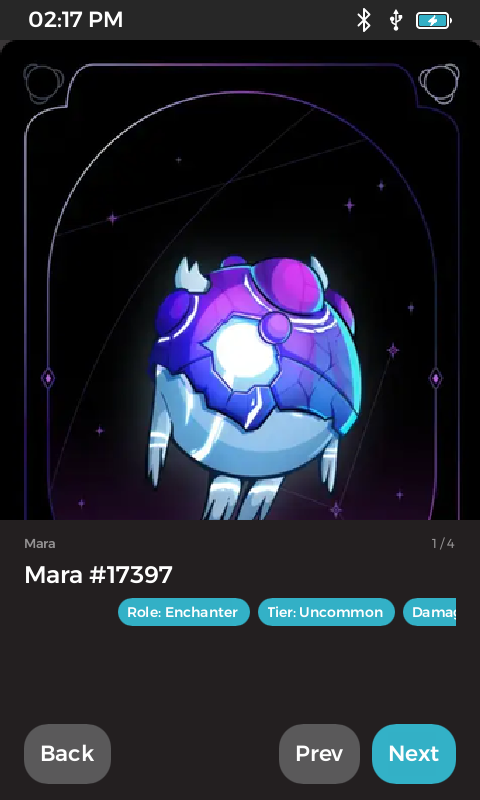

# passport-nft-viewer

A **read-only NFT gallery for the Foundation Passport Prime** hardware wallet. The host fetches what an address owns, pre-renders the images, and the device shows them — offline, with no key material anywhere near the app.

**Status:** phase 1 — working end to end on retail hardware (KeyOS 1.4.0-beta3, SDK 1.0.0): real NFTs from Ethereum rendered on the device with collection, name and trait chips.



## Design in one paragraph

Passport Prime has no network access for third-party apps, and this app never wants keys. So the work is split: `passport-nft-cli` (in the [workspace repo](https://github.com/tobyjaguar/passport-prime-dev), `host-tools/`) takes an **address** — watch-only, never a key — asks a **keyless public indexer** what it owns, downloads and downsizes each image, and converts it to KeyOS's native `.raw` texture with the SDK's own `foundation-asset-tool`. It writes a bundle to a USB drive or the Passport's Airlock. The device app reads that bundle through the KeyOS fs API (read access is grant-on-first-use — the user sees a permission prompt) and displays it, one texture resident at a time. The device never decodes an image and never contacts anything.

The app's permission manifest is `gui-app` + two file-read grants. No `os/crypto`, no `os/security`, no wallet surface. That is the whole blast radius, and anyone can verify it from the signed manifest.

## Bundle format

```
nft/
├── manifest.json     ← format, owner, chain (CAIP-2), provenance, items[], skipped[]
└── images/NNNN.raw   ← ≤ 480×480, uncompressed RGB/RGBA (3–4 B/px)
```

Each item: `file, width, height, bytes, sha256, name, collection, contract, token_id, standard, description, traits[{trait_type, value}], image_url`. The device enforces caps from the manifest before reading any image (`src/bundle.rs`): ≤480 px a side, ≤ ~920 KB, ≤50 items — because an out-of-memory condition on KeyOS kills the app outright (KeyOS #12).

## Data sources (all keyless by default)

| Chain | Source | Notes |
|---|---|---|
| Ethereum, Base, Robinhood Chain | [Blockscout](https://docs.blockscout.com/) `GET /api/v2/addresses/{addr}/nft` | No API key; rate limit advertised in headers. Very large wallets can come back empty. |
| Solana | public RPC DAS `getAssetsByOwner` | phase 1.5 |

Optional user-supplied keys (OpenSea, Alchemy) may be added as fallbacks later; nothing secret is ever baked in.

## Using it

**No install — the web page.** Open the NFT Wrapper (served from this repo's
[`web/`](web/) via GitHub Pages), pick the chain, paste or QR-scan the address,
**Fetch**, then **Write to drive…** and choose the drive's root folder. It runs
entirely in your browser: Blockscout for the list, the image hosts for the
pictures, a byte-exact port of the SDK's `.raw` writer for the textures. No
server ever sees the address. Direct writing needs a Chromium browser; Firefox
and Safari get a `.zip` to extract onto the drive. See [`web/README.md`](web/README.md).

**The CLI** (reference implementation, same bundle):

```bash
# host: build the CLI (workspace repo)
cd host-tools/passport-nft-cli && cargo build --release

# fetch a bundle straight onto the USB drive (or the Airlock mount)
passport-nft-cli fetch --chain ethereum --owner 0xYourAddress --out "/media/$USER/USB DISK"

# device: NFTs → Load from USB drive (or Load from Airlock) → tap an item
```

Airlock route (either tool): with the Passport connected, Files → Airlock → ⋯ → **Airlock Read & Write**; write the bundle from the computer (the web page's picker shows the volume as `AIRLOCK`); unplug the cable (the device can't read the Airlock while a computer owns it, and it reverts to read-only on unplug); then **Load from Airlock**.

## Build

Needs the [Foundation SDK](https://docs.foundation.xyz/developers/) v1.0+ (Nix). No KeyOS clone.

```bash
foundation develop && foundation doctor
foundation build                     # device build, signed with the publisher identity
foundation sim                       # simulator
foundation pack                      # .app for Settings > Apps > Install App
foundation sideload --no-run && foundation-passport-drive launch-app 67919a16cb73cf18293a8a1f34d09d5a
```

Tests: `FOUNDATION_THEMES_RUST_DIR=$PWD/target/foundation/themes/rust cargo test` (after one build).

## SDK notes that cost time (so you don't repeat them)

- `fs::use_api!()` needs `fs` and `server` as **direct** path dependencies; the `slint_keyos_platform::fs` re-export doesn't satisfy the macro.
- `OpenFlags::READ_ONLY` is a const (`read_only()` exists only in a doc comment); `Metadata.size`, not `len`.
- `Card` has no `@children` — use its `interactive` + `clicked` instead of nesting a `TouchArea`.
- The location's `Get*ReadAccess` message must be in the app's permission template or the first read is denied.

## Roadmap

- Web wrapper polish: single-token import (contract + id) for what Blockscout misses; multi-address bundles once the device has an address selector.
- Phase 1.5: Solana adapter; wrap/scroll long trait lists; description sheet.
- Phase 2: take addresses from the eth-wallet's exported address list ("what do the keys on this device own"), still read-only.
- Not planned: signing, buying/selling, on-device ownership verification, any network access from the device.

## Publisher

Signed with the `tobyjaguar` publisher identity — fingerprint `b5df4739d8c9e8fce8ff7d2a479a6dc6b7dada3704fd394853221cfc410de249` (verify out-of-band before allowing on your device).

## License

GPL-3.0-or-later.
